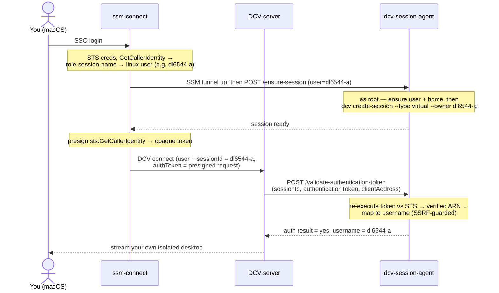

# dcv-session-agent

A small, dependency-light **Go agent + token verifier** that turns a single self-managed Amazon EC2 instance running [Amazon DCV](https://docs.aws.amazon.com/dcv/latest/adminguide/what-is-dcv.html) into a **shared multi-user GPU workstation** — where each colleague lands in their **own isolated desktop**, authenticated by their **own AWS IAM Identity Center (SSO) identity**, with **no per-user passwords, no broker, and no web portal**.

It is the on-box half of a two-part system; the other half is the [`ssm-connect`](https://github.com/vhco-pro/ssm-connect) macOS client, which opens the SSM tunnel and hands the agent a proof of identity.

> Status: **in use** — the full agent is built, and signed release binaries are published on the [releases page](https://github.com/vhco-pro/dcv-session-agent/releases). It runs in production on a self-managed multi-user DCV workstation (token verifier, on-demand virtual-session provisioning, per-user limits, and host-wide idle auto-stop). Pre-1.0, so config/flags may still change.

## Why this exists

Short version: **AWS does not offer a managed way to share one host between several users, and the self-managed building blocks stop just short of "log in as yourself."** This agent fills that exact gap. We checked this carefully before writing it — here is the reasoning, with sources.

### What AWS *does* offer (and why none of it fits a self-managed shared box)

| AWS option | What it is | Why it doesn't fit |
|------------|-----------|--------------------|
| [Amazon WorkSpaces](https://aws.amazon.com/workspaces/) | Managed DaaS | **One VM per user** — not a shared host |
| [Amazon AppStream 2.0](https://aws.amazon.com/appstream2/features/) | Managed app/desktop streaming with SAML / IAM Identity Center SSO | Also **one instance per user per stack** (100 users → 100 instances) — a managed fleet, not *your own* EC2 box |
| [Amazon DCV Session Manager](https://docs.aws.amazon.com/dcv/latest/sm-admin/what-is-sm.html) | Broker + agent + API for managing sessions across a **fleet** | The broker **must run on a separate host** — disproportionate for a single box |
| [Amazon DCV Access Console](https://docs.aws.amazon.com/dcv/latest/access-console/what-is-access-console.html) | Free, AWS-maintained self-managed **web portal**; auth via PAM / HTTP-header / **Cognito OAuth** | **Requires the Session Manager broker** as a prerequisite, plus a web server; identity via Cognito rather than your AWS SSO; a web portal instead of the native client + SSM tunnel |
| Azure Virtual Desktop *(for contrast)* | Managed broker + host agent, true multi-session shared hosts | Multi-session shared hosts are essentially Microsoft-only — **AWS has no managed equivalent.** This is the gap. |

So for "**several people share one GPU box**," you must self-manage [Amazon DCV](https://docs.aws.amazon.com/dcv/latest/adminguide/managing-sessions-intro.html).

### What DCV gives you natively — and the one piece you must build

DCV **virtual sessions** are the native mechanism for multiple users on one Linux host (each gets a dedicated `Xdcv` X server). But two gaps remain, and AWS documents both:

1. **DCV does not auto-create virtual sessions.** Per the [admin guide](https://docs.aws.amazon.com/dcv/latest/adminguide/managing-sessions-start.html): *"Amazon DCV doesn't support automatic virtual sessions"* — for the console you get one automatically, for virtual you don't. AWS's own guidance is that you *"create a custom systemd daemon"* to do it. **That daemon is this agent.**
2. **No native "log in with your AWS identity."** DCV's [external authentication](https://docs.aws.amazon.com/dcv/latest/adminguide/external-authentication.html) (`auth-token-verifier`) lets an external endpoint validate a connection token — but you supply the token mechanism. We use a **presigned `sts:GetCallerIdentity`** request (the [HashiCorp Vault / EKS `aws-iam-authenticator` pattern](https://docs.aws.amazon.com/dcv/latest/adminguide/external-authentication.html)) so the proof of identity is the same AWS credential the SSM tunnel already required — **no password, no new secret store.**

This agent implements exactly those two missing pieces, and nothing more.

### Why not just adopt DCV Access Console?

It's the closest off-the-shelf option and it's free — but adopting it means running the **Session Manager broker on a second host**, a **web portal** instead of the native DCV client, and **Cognito** instead of your real AWS SSO identity. That throws away the posture this whole project is built on: **one box, zero inbound, SSM-tunnel-only, native client, idle auto-stop.** This agent keeps that posture. (If an environment is fine with a broker, the companion client auto-detects it and defers — so adopting later is non-destructive.)

## How it works



Two HTTP surfaces, both reached only over the localhost SSM tunnel (never internet-exposed):

- **`/validate-authentication-token`** — the DCV [`auth-token-verifier`](https://docs.aws.amazon.com/dcv/latest/adminguide/external-authentication.html) endpoint. Implements the documented contract: form POST `sessionId&authenticationToken&clientAddress` → XML `<auth result="yes"><username>…</username></auth>`. Validates the presigned token by re-executing it against STS (with an SSRF guard restricting the URL to real STS endpoints).
- **`/ensure-session`** — provisions the Linux user + home (pluggable `local` / `sssd` backend, auto-detected) and runs `dcv create-session --type virtual --owner <u> --user <u>` as root if the session isn't already up. **Authenticated by the same presigned token**, so a caller can only ever provision their own session. Called by the client *before* connecting, because DCV external auth bypasses PAM and there is no login hook to lazily create the session.

## Design principles

- **Vanilla mode is the fallback.** A host can still be deployed in plain single-user (`ec2-user` + console session) mode; multi-user is opt-in. Nothing here runs on the vanilla path.
- **Zero hardcoded environment.** No account IDs, org names, or directory specifics in the binary. Behaviour is auto-detected with safe defaults and overridable by config — so it works for any org, not just ours.
- **Least privilege & no passwords.** Identity is proven by the AWS credential the SSM tunnel already required; the verifier holds no secret and validates against AWS itself.
- **Static binary.** Built in Go, no runtime to install on the box, trivial systemd unit.

## Install & configure

Drop the static binary at `/usr/local/bin/dcv-session-agent`, install the unit
from [`deploy/`](./deploy/dcv-session-agent.service), and `systemctl enable --now
dcv-session-agent`. It binds **loopback only** and is reached over the client's
SSM port-forward. (The companion DCV `dcv.conf` points its
`auth-token-verifier` at `http://127.0.0.1:8444/validate-authentication-token`.)

All configuration is environment variables on the unit (`DSA_` = **D**cv
**S**ession **A**gent); every one has a safe default:

| Variable | Default | Purpose |
|----------|---------|---------|
| `DSA_ADDR` | `127.0.0.1:8444` | Listen address. Loopback is enforced regardless — a `0.0.0.0` misconfig cannot expose the verifier. |
| `DSA_IDLE_TIMEOUT` | `30m` | Power the instance off after this long with zero DCV connections. `0` disables idle auto-stop. |
| `DSA_IDLE_INTERVAL` | `1m` | How often idle is sampled. |
| `DSA_PROVISIONING` | auto | User backend: `local` (useradd) or `sssd` (directory). Auto-detected; set to override. |
| `DSA_AUTHZ` | allow all validated identities | Restrict who may get a session: `group:<name>` or `allowlist:<path>`. |
| `DSA_USER_CPU_QUOTA` / `DSA_USER_MEMORY_MAX` / `DSA_USER_TASKS_MAX` | unset | Optional per-user systemd-slice resource caps. |

## Repository layout

```
cmd/dcv-session-agent/   entrypoint (HTTP server wiring + idle accountant goroutine)
internal/identity/       map verified STS ARN → Linux username (shared rule with the client)
internal/verifier/       DCV auth-token-verifier contract + presigned-token re-execution (SSRF-guarded)
internal/session/        provisioning backends (local/sssd, auto-detected) + ensure-session + create-session + per-user limits
internal/authz/          optional authorization rules (allow-all / group / allowlist)
internal/idle/           host-wide idle accounting → instance auto-stop
deploy/                  systemd unit
```

## Design docs

The full specification, architecture decisions (including the build-vs-adopt analysis above as ADR-8), and the phased implementation plan live in the central design-docs location alongside the v1 single-user workstation spec, and the empirical validation results are recorded there (spec §12.4).

## Build

```sh
go build ./...
go test ./...
```

## License

[Apache-2.0](./LICENSE).
